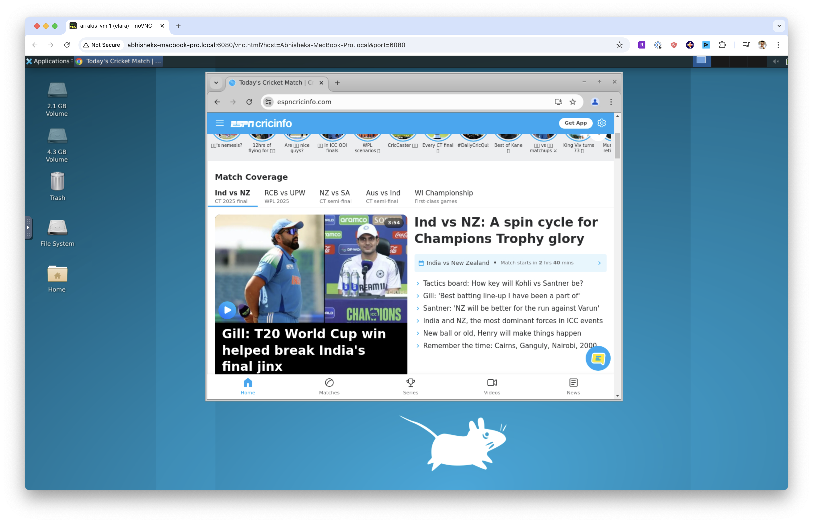
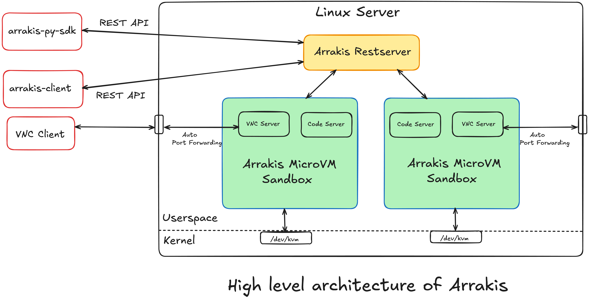

# Arrakis

[](./LICENSE)

## Introduction ##

AI agents can generate malicious or buggy code that can attack the host system its run on. 

Many agents have elaborate multi-step plans to achieve their goals and benefit from the ability to backtrack to intermediate states.

**Arrakis** provides a **fully customizable** and **self-hosted** solution to spawn and manage Sandboxes for code execution and computer use. It has out-of-the box support for backtracking via **snapshot-and-restore**.

- Each sandbox runs Ubuntu inside with a code execution service and a VNC server running at boot.

- A REST API and a Python SDK let clients (both humans and AI Agents) programatically spawn sandboxes, upload files, a and execute code inside each sandbox.

- Automatically sets up and manages port forwarding from the self-hosted public server to the sanboxes running on it i.e. clients can easily access the sandbox GUI (including Chrome for computer use) without extra setup.

- Supports **snapshot-and-restore** out of the box i.e. AI Agents can do some work, snapshot a sandbox, and later backtrack to the exact previous state by restoring the snapshot. This means any processes spawned, files modified etc. will be restored as is inside the sandbox.Useful for Monte Carlo Tree Search based agents or explainability of elaborate agent execution flows.

- Secure by design, each sandbox [runs in a MicroVM](#architecture-and-features).

---

## Table of Contents

- [Introduction](#introduction)
- [Quickstart - SDK](#quickstart---sdk)
- [Quickstart - GUI For Computer Use](#quickstart---gui-for-computer-use)
- [Architecture And Features](#architecture-and-features)
- [Prerequisites](#prerequisites)
- [Installation](#installation)
- [Build](#build)
- [Build a custom rootfs for the guest](#build-a-custom-rootfs-for-the-guest)
- [Configuration](#configuration)
- [Usage](#usage)
- [Ongoing Work](#ongoing-work)
- [Contribution](#contribution)
  - [Legal Info](#legal-info)
    - [Contributor License Agreement](#contributor-license-agreement)
    - [License](#license)
- [License](#license)

___

## Quickstart - SDK

Arrakis comes with a Python SDK [py-arrakis](https://pypi.org/project/py-arrakis/) that lets you spawn, manage, and interact with VMs seamlessly.

- Install the SDK
  ```bash
  pip install py-arrakis
  ```

- Follow the instructions in [Usage](#usage) to run the `arrakis-restserver` on a Linux machine.

- Use py-arrakis to interact with `arrakis-restserver`.

- Run untrusted code
  ```python
  # Replace this with the ip:port where `arrakis-restserver` is running.
  sandbox_manager = SandboxManager('http://127.0.0.1:7000')

  # Start a new sandbox.
  with sb as sandbox_manager.start_sandbox('agent-sandbox'):
    sb.run_cmd('echo hello world')

  # Sandbox `sb` automatically destroyed when the context is exited.
  ```

- Snapshot and restore a sandbox
  ```python
  # Start a sandbox and write some data to a file.
  sandbox_name = 'agent-sandbox'
  sandbox = sandbox_manager.start_sandbox(sandbox_name)
  sandbox.run_cmd("echo 'test data before snapshot' > /tmp/testfile")
  snapshot_id = sandbox.snapshot("initial-state")
  sandbox.run_cmd("echo 'test data after snapshot' > /tmp/testfile")

  # Destroy the sandbox.
  sandbox.destroy()

  # Restore the sandbox from the snapshot and verify we have the same data at the time of the
  # snapshot.
  sandbox = sandbox_manager.restore(sandbox_name, snapshot_id)
  result = sandbox.run_cmd("cat /tmp/testfile")
  # result["output"] should be "test data before snapshot".
  ```

___

## Quickstart - GUI For Computer Use



- Every sandbox comes with a VNC server running at boot. It also comes with Chrome pre-installed.

- Arrakis also handles port forwarding to expose the VNC server via a port on the dev server running `arrakis-restserver`.

- Start a sandbox and get metadata about the sandbox including the VNC connection details.

  ```python
  # Replace this with the ip:port where `arrakis-restserver` is running.
  sandbox_manager = SandboxManager('http://127.0.0.1:7000')
  sb = sandbox_manager.start_sandbox('agent-sandbox')
  print(sb.info())
  ```

- We can get the VNC connection details from the `port_forwards` field in the response. The VNC server is represented by the description `gui` in a port forward entry. We will use the `host_port` field to connect to the VNC server.
  ```bash
  {
    'name': 'agent-sandbox',
    'status': 'RUNNING',
    'ip': '10.20.1.2/24',
    'tap_device_name': 'tap0',
    'port_forwards': [{'host_port': '3000', 'guest_port': '5901', 'description': 'gui'}]
  }
  ```

- Use any [VNC client](https://github.com/novnc/noVNC) to connect to the VNC server to access the GUI.
  ```bash
  # We see port 3000 is the host port forwarded to the VNC server running inside the sandbox.
  ./utils/novnc_proxy --vnc <dev-server-ip>:3000
  ```
___

## Architecture And Features



`arrakis` includes the following services and features

- **REST API**
  - **arrakis-restserver**
    - A daemon that exposes a REST API to *start*, *stop*, *destroy*, *list-all* VMs. Every VM started is managed by this server i.e. the lifetime of each VM is tied to the lifetime of this daemon.
    - The api is present at [api/server-api.yaml](./api/server-api.yaml).
    - [Code](./cmd/restserver)
  - **arrakis-client**
    - A Golang CLI that you can use to interact with **arrakis-restserver** to spawn and manage VMs.
    - [Code](./cmd/client)

- **Python SDK**
  - Completed, todo on official shipping and linking here.

- **Security**
  - Each sandbox runs in a MicroVM.
    - MicroVMs are lightweight Virtual Machines (compared to traditional VMs) powered by Rust based Virtual Machine Managers such as [firecracker](https://github.com/firecracker-microvm/firecracker) and [cloud-hypervisor](https://github.com/cloud-hypervisor/cloud-hypervisor).
    - **Arrakis** uses [cloud-hypervisor](https://github.com/cloud-hypervisor/cloud-hypervisor) as the VMM.
  - Any untrusted code executed within the sandbox is isolated from the host machine as well as other agents.
  - We use overlayfs to also protect the root filesystem of each sandbox.

- **Customization**
  - Dockerfile based rootfs customization.
    - Easily add packages and binaries to your VM's rootfs by manipulating a [Dockerfile](./resources/scripts/rootfs/Dockerfile).
  - Out of the box networking setup for the guest.
    - Each sandbox gets a tap device that gets added to a Linux bridge on the host.
    - ssh access to the sandbox.
  - Prebuilt Linux kernel for the sandbox
    - Or pass your own kernel to **arrakis-client** while starting VMs.

---

## Prerequisites

- `cloud-hypervisor` only works with `/dev/kvm` for virtualization on Linux machines. Hence, we only support Linux machines.
- The [cloud-hypervisor](https://github.com/cloud-hypervisor/cloud-hypervisor) binary installed on the host. More on this in the [Configuration](#Configuration) section.
- Any recent host (machine you'll run the **arrakis-restserver** on) Linux kernel >= 2.6.
- Check if virtualization is enabled on the host by running. 
    ```bash
    stat /dev/kvm
    ```
- [Golang >= 1.23](https://go.dev/) installed on the host machine.

---

## Installation

- Install Golang dependencies using -
    ```bash
    go mod tidy
    ```

- The easiest way to install prerequisite images is to use the `install-images.py` script.
    ```bash
    ./install-images.py
    ```

- The following images are installed by the script above and can also be installed manually -
  
  - Install the [cloud-hypervisor](https://github.com/cloud-hypervisor/cloud-hypervisor) binary and note down the path of the binary. This will be used in the [Configuration](#configuration) section. By default we look for this binary at `resources/bin/cloud-hypervisor`, you may place it there.

  - Download the prebuilt guest kernel for the VM from [arrakis-images](https://github.com/abshkbh/arrakis-images/blob/main/guest/kernel/vmlinux.bin), note down the path. This will be used in the [Configuration](#configuration) section. By default we look for this binary at `resources/bin/vmlinux.bin`, you may place it there.

---

## Build

- Make everything. You"ll be prompted by `sudo` once while making the guest rootfs.
    ```bash
    make all
    ```
  All binaries will be placed in `./out`.

- The following binaries are built -
  - **arrakis-restserver** - A daemon exposing a REST API to create, manage and interact with cloud-hypervisor based MicroVMs.
  - **arrakis-client** - A CLI client to communicate with **arrakis-restserver**.
  - **arrakis-cmdserver** - A daemon to execute shell commands that can be put inside the guest using the [Dockerfile](./resources/scripts/rootfs/Dockerfile) and **arrakis-rootfsmaker**.
  - **arrakis-codeserver** - A daemon to run **python** or **typescript** node that can be put inside the guest using the `Dockerfile` and **arrakis-rootfsmaker**.
  - **arrakis-guestinit** - The init running inside the MicroVM guest.
  - **arrakis-guestrootfs-ext4.img** - The rootfs used for the MicroVM guest.
  - **arrakis-rootfsmaker** - The program used to convert the [Dockerfile](./resources/scripts/rootfs/Dockerfile) into the guest rootfs (**arrakis-guestrootfs-ext4.img**).
  - `gen` - Contains the generated code for both the [cloud-hypervisor API](./api/arrakis-api.yaml) (used by **arrakis-restserver**) and [REST server API](./api/server-api.yaml) (used by **arrakis-client**).  

- Clean all binaries.
    ```bash
    make clean
    ```

---

## Build a custom rootfs for the guest

- The rootfs for guests can be configured using the provided [Dockerfile](./resources/scripts/rootfs/Dockerfile).

  - An example of how custom binaries can be added to the rootfs can be found [here](./resources/scripts/rootfs/Dockerfile#L66).
    - By default we keep custom binaries at `/opt/custom_scripts/` within the guest.  

- Command to make the guest rootfs -
  ```bash
  make guestrootfs
  ```

---

## Configuration

- A [config.yaml](./config.yaml) file is used to configure all the services provided by this project. It has defaults but could be modified.

- Configuring services on the host -
  - Host services are configured under the `hostservices` section.

- Configuring **arrakis-restserver** -
  - The `hostservices` -> `restserver` sub-section is used.
  - **state_dir** - Where each MicroVM's runtime state is stored.
  - **chv_bin** - The path to the **cloud-hypervisor** binary on the host.
  - **kernel** - The path to the kernel to be used for all MicroVMs.
  - **rootfs** - The path to the rootfs to be used for all MicroVMs. Set to **./out/arrakis-guestrootfs-ext4.img** by default.

- Configuring **arrakis-client** -
  - The `hostservices` -> `client` sub-section is used.
  - **server_host** - The IP at which the **arrakis-restserver** running.
  - **server_port** - The port at which the **arrakis-restserver** is running.

- Configuring services inside the guest -
  - Guest services are configured under the `guestservices` section.
  - The sample config file has an example for an optional **codeserver** inside the guest.

---

## Usage

- Before anything we need our `arrakis-restserver` to start. Start it with -
  ```bash
  sudo ./out/arrakis-restserver
  ```
- Root access is only needed to configure **iptables** for guest networking. Removing the root dependency is being currently worked on.

- In a separate shell we will use the CLI client to create and manage VMs.

- Start a VM named `foo`. It returns metadata about the VM which could be used to interacting with the VM.
  ```bash
  ./out/arrakis-client start -n foo
  ```
  
  ```bash
  started VM: {"codeServerPort":"","ip":"10.20.1.2/24","status":"RUNNING","tapDeviceName":"tap-foo","vmName":"foo"}
  ```

- SSH into the VM.
  - ssh credentials are configured [here](./resources/scripts/rootfs/Dockerfile#L6).
  ```bash
  # Use the IP returned. Password is "elara0000"
  ssh elara@10.20.1.2
  ```

- Inspecting a VM named `foo`.
  ```bash
  ./out/arrakis-client list -n foo
  ```

  ```bash
  VM: {"ip":"10.20.1.2/24","status":"RUNNING","tapDeviceName":"tap-foo","vmName":"foo"}
  ```

- List all the VMs.
  ```bash
  ./out/arrakis-client list-all
  ```

  ```bash
  VMs: {"vms":[{"ip":"10.20.1.2/24","status":"RUNNING","tapDeviceName":"tap-foo","vmName":"foo"}]}
  ```

- Stop the VM.
  ```bash
  ./out/arrakis-client stop -n foo
  ```

- Destroy the VM.
  ```bash
  ./out/arrakis-client destroy -n foo
  ```

- Snapshotting and Restoring the VM.
  - We support snapshotting the VM and then using the snapshot to restore the VM. Currently, we restore the VM to use the same IP as the original VM. If you plan to restore the VM on the same host then either stop or destroy the original VM before restoring. In the future this won't be a constraint.
  ```bash
  ./out/arrakis-client snapshot -n foo-original -o foo-snapshot
  ```

  ```bash
  ./out/arrakis-client destroy -n foo-original -o foo-snapshot
  ```

  ```bash
  ./out/arrakis-client restore -n foo-original --snapshot foo-snapshot
  ```

---

## Ongoing Work

- Reduce sandbox startup time to less than 500 ms.

- Making existing coding agents work with Arrakis.

---

## Contribution

Thank you for considering contributing to **arrakis**! 🎉

Feel free to open a PR. A detailed contribution guide is going to be available soon.

## Legal Info

### Contributor License Agreement

In order for us to accept patches and other contributions from you, you need to adopt our Arrakis Contributor License Agreement (the "**CLA**"). Please drop a line at abshkbh@gmail.com to start this process.

Arrakis uses a tool called CLA Assistant to help us keep track of the CLA status of contributors. CLA Assistant will post a comment to your pull request indicating whether you have signed the CLA or not. If you have not signed the CLA, you will need to do so before we can accept your contribution. Signing the CLA would be one-time process, is valid for all future contributions to Arrakis, and can be done in under a minute by signing in with your GitHub account.


### License

By contributing to Arrakis, you agree that your contributions will be licensed under the [GNU Affero General Public License v3.0](LICENSE) and as commercial software.

---

## License

This project is licensed under the [GNU Affero General Public License v3.0](./LICENSE). For commercial licensing, please drop a line at abshkbh@gmail.com.

---
